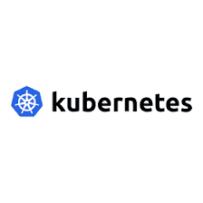
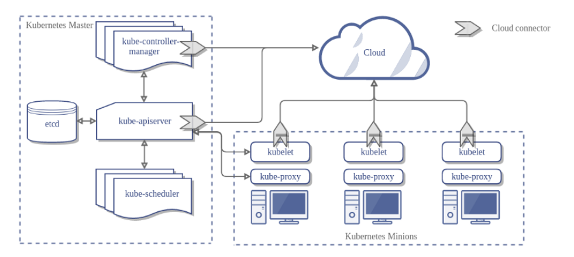

<h1>Kubernetes </h1>

## Option1: Setting Up a Kubernetes Cluster with kubeadm

This repository provides step-by-step instructions and resources for setting up a Kubernetes cluster from scratch using kubeadm. Whether you're new to Kubernetes or need a refresher, this guide will help you get started with your own Kubernetes cluster.

### Prerequisites

* One or more machines running a deb/rpm-compatible Linux OS; for example: Ubuntu or CentOS.
* 2 GiB or more of RAM per machine--any less leaves little room for your apps.
* At least 2 CPUs on the machine that you use as a control-plane node.
* Full network connectivity among all machines in the cluster. You can use either a public or a private network.

### Getting Started

To SetUp the Kubernetes cluster using the Kubeadm Follow The Instructions at <a href="https://github.com/mohamedbenaantar/Kubernetes-CKA/blob/main/SetUp-KubeadmCluster/Kubeadm-Install.md">SetUp Using the Kubeadm</a> 

## Option2: Upgrade the Kubeadm cluster

--> Make sure to create ETCD BackUp before do the upgrade then follow the Principal Layers Listed at <a href="https://github.com/mohamedbenaantar/Kubernetes-CKA/blob/main/SetUp-KubeadmCluster/Kubedm-Upgrade.md">Upgrade the cluster</a>

## Option3: SetUp the Kubernetes Cluster from scratch 

==> If you prefer to manually configure the cluster by deploying individual components, follow the steps listed at <a href="Cluster-HardWay">SetUp Cluster from Scratch</a><

